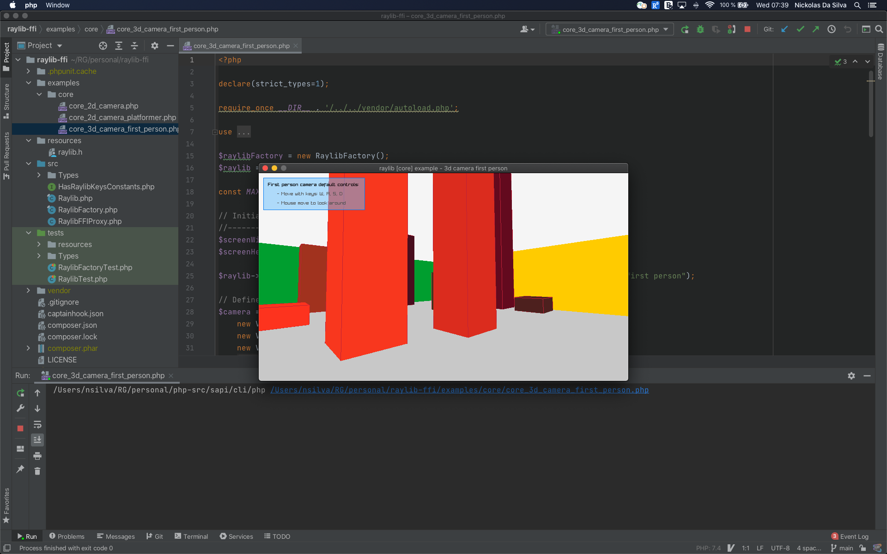

Raylib FFI
---

Raylib bindings for PHP using [FFI](https://thephp.website/en/issue/php-ffi/).

## Contributing

This project is still under development and contributions are very welcome!

[Please see this quick guide on how to get started with contributions](https://github.com/nawarian/raylib-ffi/wiki/Quick-guide-to-increase-Raylib-FFI's-coverage).

## Usage

See [examples/](https://github.com/nawarian/raylib-ffi/tree/main/examples/) for full implementation examples.

Every program will look like the following at first:

```php
/**
 * The factory class will create an instance based on your
 * Operating System.
 */
$factory = new \Nawarian\Raylib\RaylibFactory();
$raylib = $factory->newInstance();

/**
 * You may normally call Raylib functions from the $raylib object now
 */
$raylib->initWindow(800, 600, 'My raylib Window');

$white = new \Nawarian\Raylib\Types\Color(255, 255, 255, 255);
$red = new \Nawarian\Raylib\Types\Color(255, 0, 0, 255);
while (!$raylib->windowShouldClose()) {
    $raylib->beginDrawing();
        $raylib->clearBackground($white);
        $raylib->drawText('Hello from raylib-ffi!', 400, 300, 20, $red);
    $raylib->endDrawing();
}

$raylib->closeWindow();
```

### Recent Impressive Screenshot

Here's a screenshot taken from the [core_3d_camera_first_person](examples/core/core_3d_camera_first_person.php) program.

It generates random buildings on start up and creates a 3D first-person camera, allowing
the player to walk freely using W,A,S,D keys and the cursor.



## Roadmap

Below you'll find the list of things to be developed in this project.

### Project

- [ ] Automatic checks on `main` and Pull Requests: compile raylib and test FFI against Linux, Windows and MacOS
- [x] Rename methods in `Raylib` to follow No Camel Caps convention (PSR-1)
- [ ] Make `RaylibFactory` detect current OS and load `raylib.h` accordingly
- [ ] Create a `functions.php` file that will mimic Raylib by registering global functions

### FFI Proxy

- [x] `void InitWindow(int width, int height, const char *title)`
- [x] `bool WindowShouldClose(void)`
- [x] `void CloseWindow(void)`
- [ ] `bool IsWindowReady(void)`
- [ ] `bool IsWindowFullscreen(void)`
- [ ] `bool IsWindowHidden(void)`
- [ ] `bool IsWindowMinimized(void)`
- [ ] `bool IsWindowMaximized(void)`
- [ ] `bool IsWindowFocused(void)`
- [ ] `bool IsWindowResized(void)`
- [x] `bool IsWindowState(unsigned int flag)`
- [x] `void SetWindowState(unsigned int flags)`
- [x] `void ClearWindowState(unsigned int flags)`
- [x] `void ToggleFullscreen(void)`
- [x] `void MaximizeWindow(void)`
- [x] `void MinimizeWindow(void)`
- [x] `void RestoreWindow(void)`
- [ ] `void SetWindowIcon(Image image)`
- [ ] `void SetWindowTitle(const char *title)`
- [ ] `void SetWindowPosition(int x, int y)`
- [ ] `void SetWindowMonitor(int monitor)`
- [ ] `void SetWindowMinSize(int width, int height)`
- [ ] `void SetWindowSize(int width, int height)`
- [ ] `void *GetWindowHandle(void)`
- [x] `int GetScreenWidth(void)`
- [x] `int GetScreenHeight(void)`
- [ ] `int GetMonitorCount(void)`
- [ ] `Vector2 GetMonitorPosition(int monitor)`
- [ ] `int GetMonitorWidth(int monitor)`
- [ ] `int GetMonitorHeight(int monitor)`
- [ ] `int GetMonitorPhysicalWidth(int monitor)`
- [ ] `int GetMonitorPhysicalHeight(int monitor)`
- [ ] `int GetMonitorRefreshRate(int monitor)`
- [ ] `Vector2 GetWindowPosition(void)`
- [ ] `Vector2 GetWindowScaleDPI(void)`
- [ ] `const char *GetMonitorName(int monitor)`
- [ ] `void SetClipboardText(const char *text)`
- [ ] `const char *GetClipboardText(void)`
- [ ] `void ShowCursor(void)`
- [ ] `void HideCursor(void)`
- [ ] `bool IsCursorHidden(void)`
- [ ] `void EnableCursor(void)`
- [ ] `void DisableCursor(void)`
- [ ] `bool IsCursorOnScreen(void)`
- [x] `void ClearBackground(Color color)`
- [x] `void BeginDrawing(void)`
- [x] `void EndDrawing(void)`
- [x] `void BeginMode2D(Camera2D camera)`
- [x] `void EndMode2D(void)`
- [x] `void BeginMode3D(Camera3D camera)`
- [x] `void EndMode3D(void)`
- [ ] `void BeginTextureMode(RenderTexture2D target)`
- [ ] `void EndTextureMode(void)`
- [x] `void BeginScissorMode(int x, int y, int width, int height)`
- [x] `void EndScissorMode(void)`
- [x] `Ray GetMouseRay(Vector2 mousePosition, Camera camera)`
- [ ] `Matrix GetCameraMatrix(Camera camera)`
- [ ] `Matrix GetCameraMatrix2D(Camera2D camera)`
- [x] `Vector2 GetWorldToScreen(Vector3 position, Camera camera)`
- [ ] `Vector2 GetWorldToScreenEx(Vector3 position, Camera camera, int width, int height)`
- [x] `Vector2 GetWorldToScreen2D(Vector2 position, Camera2D camera)`
- [x] `Vector2 GetScreenToWorld2D(Vector2 position, Camera2D camera)`
- [x] `void SetTargetFPS(int fps)`
- [x] `int GetFPS(void)`
- [x] `float GetFrameTime(void)`
- [x] `double GetTime(void)`
- [x] `void SetConfigFlags(unsigned int flags)`
- [ ] `void SetTraceLogLevel(int logType)`
- [ ] `void SetTraceLogExit(int logType)`
- [ ] `void SetTraceLogCallback(TraceLogCallback callback)`
- [ ] `void TraceLog(int logType, const char *text, ...)`
- [ ] `void *MemAlloc(int size)`
- [ ] `void MemFree(void *ptr)`
- [ ] `void TakeScreenshot(const char *fileName)`
- [x] `int GetRandomValue(int min, int max)`
- [ ] `unsigned char *LoadFileData(const char *fileName, unsigned int *bytesRead)`
- [ ] `void UnloadFileData(unsigned char *data)`
- [ ] `bool SaveFileData(const char *fileName, void *data, unsigned int bytesToWrite)`
- [ ] `char *LoadFileText(const char *fileName)`
- [ ] `void UnloadFileText(unsigned char *text)`
- [ ] `bool SaveFileText(const char *fileName, char *text)`
- [ ] `bool FileExists(const char *fileName)`
- [ ] `bool DirectoryExists(const char *dirPath)`
- [ ] `bool IsFileExtension(const char *fileName, const char *ext)`
- [ ] `const char *GetFileExtension(const char *fileName)`
- [ ] `const char *GetFileName(const char *filePath)`
- [ ] `const char *GetFileNameWithoutExt(const char *filePath)`
- [ ] `const char *GetDirectoryPath(const char *filePath)`
- [ ] `const char *GetPrevDirectoryPath(const char *dirPath)`
- [ ] `const char *GetWorkingDirectory(void)`
- [ ] `char **GetDirectoryFiles(const char *dirPath, int *count)`
- [ ] `void ClearDirectoryFiles(void)`
- [ ] `bool ChangeDirectory(const char *dir)`
- [ ] `bool IsFileDropped(void)`
- [ ] `char **GetDroppedFiles(int *count)`
- [ ] `void ClearDroppedFiles(void)`
- [ ] `long GetFileModTime(const char *fileName)`
- [ ] `unsigned char *CompressData(unsigned char *data, int dataLength, int *compDataLength)`
- [ ] `unsigned char *DecompressData(unsigned char *compData, int compDataLength, int *dataLength)`
- [x] `bool SaveStorageValue(unsigned int position, int value)`
- [x] `int LoadStorageValue(unsigned int position)`
- [ ] `void OpenURL(const char *url)`
- [x] `bool IsKeyPressed(int key)`
- [x] `bool IsKeyDown(int key)`
- [ ] `bool IsKeyReleased(int key)`
- [ ] `bool IsKeyUp(int key)`
- [ ] `void SetExitKey(int key)`
- [ ] `int GetKeyPressed(void)`
- [ ] `int GetCharPressed(void)`
- [ ] `bool IsGamepadAvailable(int gamepad)`
- [ ] `bool IsGamepadName(int gamepad, const char *name)`
- [ ] `const char *GetGamepadName(int gamepad)`
- [ ] `bool IsGamepadButtonPressed(int gamepad, int button)`
- [ ] `bool IsGamepadButtonDown(int gamepad, int button)`
- [ ] `bool IsGamepadButtonReleased(int gamepad, int button)`
- [ ] `bool IsGamepadButtonUp(int gamepad, int button)`
- [ ] `int GetGamepadButtonPressed(void)`
- [ ] `int GetGamepadAxisCount(int gamepad)`
- [ ] `float GetGamepadAxisMovement(int gamepad, int axis)`
- [x] `bool IsMouseButtonPressed(int button)`
- [ ] `bool IsMouseButtonDown(int button)`
- [ ] `bool IsMouseButtonReleased(int button)`
- [ ] `bool IsMouseButtonUp(int button)`
- [x] `int GetMouseX(void)`
- [x] `int GetMouseY(void)`
- [x] `Vector2 GetMousePosition(void)`
- [ ] `void SetMousePosition(int x, int y)`
- [ ] `void SetMouseOffset(int offsetX, int offsetY)`
- [ ] `void SetMouseScale(float scaleX, float scaleY)`
- [x] `float GetMouseWheelMove(void)`
- [ ] `int GetMouseCursor(void)`
- [ ] `void SetMouseCursor(int cursor)`
- [ ] `int GetTouchX(void)`
- [ ] `int GetTouchY(void)`
- [ ] `Vector2 GetTouchPosition(int index)`
- [ ] `void SetGesturesEnabled(unsigned int gestureFlags)`
- [ ] `bool IsGestureDetected(int gesture)`
- [ ] `int GetGestureDetected(void)`
- [ ] `int GetTouchPointsCount(void)`
- [ ] `float GetGestureHoldDuration(void)`
- [ ] `Vector2 GetGestureDragVector(void)`
- [ ] `float GetGestureDragAngle(void)`
- [ ] `Vector2 GetGesturePinchVector(void)`
- [ ] `float GetGesturePinchAngle(void)`
- [x] `void SetCameraMode(Camera camera, int mode)`
- [x] `void UpdateCamera(Camera *camera)`
- [ ] `void SetCameraPanControl(int keyPan)`
- [ ] `void SetCameraAltControl(int keyAlt)`
- [ ] `void SetCameraSmoothZoomControl(int keySmoothZoom)`
- [ ] `void SetCameraMoveControls(int keyFront, int keyBack, int keyRight, int keyLeft, int keyUp, int keyDown)`
- [ ] `void DrawPixel(int posX, int posY, Color color)`
- [ ] `void DrawPixelV(Vector2 position, Color color)`
- [x] `void DrawLine(int startPosX, int startPosY, int endPosX, int endPosY, Color color)`
- [ ] `void DrawLineV(Vector2 startPos, Vector2 endPos, Color color)`
- [ ] `void DrawLineEx(Vector2 startPos, Vector2 endPos, float thick, Color color)`
- [ ] `void DrawLineBezier(Vector2 startPos, Vector2 endPos, float thick, Color color)`
- [ ] `void DrawLineStrip(Vector2 *points, int pointsCount, Color color)`
- [x] `void DrawCircle(int centerX, int centerY, float radius, Color color)`
- [ ] `void DrawCircleSector(Vector2 center, float radius, int startAngle, int endAngle, int segments, Color color)`
- [ ] `void DrawCircleSectorLines(Vector2 center, float radius, int startAngle, int endAngle, int segments, Color color)`
- [x] `void DrawCircleGradient(int centerX, int centerY, float radius, Color color1, Color color2)`
- [x] `void DrawCircleV(Vector2 center, float radius, Color color)`
- [x] `void DrawCircleLines(int centerX, int centerY, float radius, Color color)`
- [ ] `void DrawEllipse(int centerX, int centerY, float radiusH, float radiusV, Color color)`
- [ ] `void DrawEllipseLines(int centerX, int centerY, float radiusH, float radiusV, Color color)`
- [ ] `void DrawRing(Vector2 center, float innerRadius, float outerRadius, int startAngle, int endAngle, int segments, Color color)`
- [ ] `void DrawRingLines(Vector2 center, float innerRadius, float outerRadius, int startAngle, int endAngle, int segments, Color color)`
- [x] `void DrawRectangle(int posX, int posY, int width, int height, Color color)`
- [ ] `void DrawRectangleV(Vector2 position, Vector2 size, Color color)`
- [ ] `void DrawRectangleRec(Rectangle rec, Color color)`
- [ ] `void DrawRectanglePro(Rectangle rec, Vector2 origin, float rotation, Color color)`
- [ ] `void DrawRectangleGradientV(int posX, int posY, int width, int height, Color color1, Color color2)`
- [x] `void DrawRectangleGradientH(int posX, int posY, int width, int height, Color color1, Color color2)`
- [ ] `void DrawRectangleGradientEx(Rectangle rec, Color col1, Color col2, Color col3, Color col4)`
- [x] `void DrawRectangleLines(int posX, int posY, int width, int height, Color color)`
- [x] `void DrawRectangleLinesEx(Rectangle rec, int lineThick, Color color)`
- [ ] `void DrawRectangleRounded(Rectangle rec, float roundness, int segments, Color color)`
- [ ] `void DrawRectangleRoundedLines(Rectangle rec, float roundness, int segments, int lineThick, Color color)`
- [x] `void DrawTriangle(Vector2 v1, Vector2 v2, Vector2 v3, Color color)`
- [x] `void DrawTriangleLines(Vector2 v1, Vector2 v2, Vector2 v3, Color color)`
- [ ] `void DrawTriangleFan(Vector2 *points, int pointsCount, Color color)`
- [ ] `void DrawTriangleStrip(Vector2 *points, int pointsCount, Color color)`
- [x] `void DrawPoly(Vector2 center, int sides, float radius, float rotation, Color color)`
- [ ] `void DrawPolyLines(Vector2 center, int sides, float radius, float rotation, Color color)`
- [x] `bool CheckCollisionRecs(Rectangle rec1, Rectangle rec2)`
- [ ] `bool CheckCollisionCircles(Vector2 center1, float radius1, Vector2 center2, float radius2)`
- [ ] `bool CheckCollisionCircleRec(Vector2 center, float radius, Rectangle rec)`
- [ ] `bool CheckCollisionPointRec(Vector2 point, Rectangle rec)`
- [ ] `bool CheckCollisionPointCircle(Vector2 point, Vector2 center, float radius)`
- [ ] `bool CheckCollisionPointTriangle(Vector2 point, Vector2 p1, Vector2 p2, Vector2 p3)`
- [ ] `bool CheckCollisionLines(Vector2 startPos1, Vector2 endPos1, Vector2 startPos2, Vector2 endPos2, Vector2 *collisionPoint)`
- [x] `Rectangle GetCollisionRec(Rectangle rec1, Rectangle rec2)`
- [x] `Image LoadImage(const char *fileName)`
- [ ] `Image LoadImageRaw(const char *fileName, int width, int height, int format, int headerSize)`
- [ ] `Image LoadImageAnim(const char *fileName, int *frames)`
- [ ] `Image LoadImageFromMemory(const char *fileType, const unsigned char *fileData, int dataSize)`
- [x] `void UnloadImage(Image image)`
- [ ] `bool ExportImage(Image image, const char *fileName)`
- [ ] `bool ExportImageAsCode(Image image, const char *fileName)`
- [ ] `Image GenImageColor(int width, int height, Color color)`
- [ ] `Image GenImageGradientV(int width, int height, Color top, Color bottom)`
- [ ] `Image GenImageGradientH(int width, int height, Color left, Color right)`
- [ ] `Image GenImageGradientRadial(int width, int height, float density, Color inner, Color outer)`
- [ ] `Image GenImageChecked(int width, int height, int checksX, int checksY, Color col1, Color col2)`
- [ ] `Image GenImageWhiteNoise(int width, int height, float factor)`
- [ ] `Image GenImagePerlinNoise(int width, int height, int offsetX, int offsetY, float scale)`
- [ ] `Image GenImageCellular(int width, int height, int tileSize)`
- [ ] `Image ImageCopy(Image image)`
- [ ] `Image ImageFromImage(Image image, Rectangle rec)`
- [ ] `Image ImageText(const char *text, int fontSize, Color color)`
- [ ] `Image ImageTextEx(Font font, const char *text, float fontSize, float spacing, Color tint)`
- [ ] `void ImageFormat(Image *image, int newFormat)`
- [ ] `void ImageToPOT(Image *image, Color fill)`
- [ ] `void ImageCrop(Image *image, Rectangle crop)`
- [ ] `void ImageAlphaCrop(Image *image, float threshold)`
- [ ] `void ImageAlphaClear(Image *image, Color color, float threshold)`
- [ ] `void ImageAlphaMask(Image *image, Image alphaMask)`
- [ ] `void ImageAlphaPremultiply(Image *image)`
- [ ] `void ImageResize(Image *image, int newWidth, int newHeight)`
- [ ] `void ImageResizeNN(Image *image, int newWidth,int newHeight)`
- [ ] `void ImageResizeCanvas(Image *image, int newWidth, int newHeight, int offsetX, int offsetY, Color fill)`
- [ ] `void ImageMipmaps(Image *image)`
- [ ] `void ImageDither(Image *image, int rBpp, int gBpp, int bBpp, int aBpp)`
- [ ] `void ImageFlipVertical(Image *image)`
- [ ] `void ImageFlipHorizontal(Image *image)`
- [ ] `void ImageRotateCW(Image *image)`
- [ ] `void ImageRotateCCW(Image *image)`
- [ ] `void ImageColorTint(Image *image, Color color)`
- [ ] `void ImageColorInvert(Image *image)`
- [ ] `void ImageColorGrayscale(Image *image)`
- [ ] `void ImageColorContrast(Image *image, float contrast)`
- [ ] `void ImageColorBrightness(Image *image, int brightness)`
- [ ] `void ImageColorReplace(Image *image, Color color, Color replace)`
- [ ] `Color *LoadImageColors(Image image)`
- [ ] `Color *LoadImagePalette(Image image, int maxPaletteSize, int *colorsCount)`
- [ ] `void UnloadImageColors(Color *colors)`
- [ ] `void UnloadImagePalette(Color *colors)`
- [ ] `Rectangle GetImageAlphaBorder(Image image, float threshold)`
- [ ] `void ImageClearBackground(Image *dst, Color color)`
- [ ] `void ImageDrawPixel(Image *dst, int posX, int posY, Color color)`
- [ ] `void ImageDrawPixelV(Image *dst, Vector2 position, Color color)`
- [ ] `void ImageDrawLine(Image *dst, int startPosX, int startPosY, int endPosX, int endPosY, Color color)`
- [ ] `void ImageDrawLineV(Image *dst, Vector2 start, Vector2 end, Color color)`
- [ ] `void ImageDrawCircle(Image *dst, int centerX, int centerY, int radius, Color color)`
- [ ] `void ImageDrawCircleV(Image *dst, Vector2 center, int radius, Color color)`
- [ ] `void ImageDrawRectangle(Image *dst, int posX, int posY, int width, int height, Color color)`
- [ ] `void ImageDrawRectangleV(Image *dst, Vector2 position, Vector2 size, Color color)`
- [x] `void ImageDrawRectangleRec(Image *dst, Rectangle rec, Color color)`
- [ ] `void ImageDrawRectangleLines(Image *dst, Rectangle rec, int thick, Color color)`
- [ ] `void ImageDraw(Image *dst, Image src, Rectangle srcRec, Rectangle dstRec, Color tint)`
- [x] `void ImageDrawText(Image *dst, const char *text, int posX, int posY, int fontSize, Color color)`
- [ ] `void ImageDrawTextEx(Image *dst, Font font, const char *text, Vector2 position, float fontSize, float spacing, Color tint)`
- [x] `Texture2D LoadTexture(const char *fileName)`
- [x] `Texture2D LoadTextureFromImage(Image image)`
- [ ] `TextureCubemap LoadTextureCubemap(Image image, int layoutType)`
- [ ] `RenderTexture2D LoadRenderTexture(int width, int height)`
- [x] `void UnloadTexture(Texture2D texture)`
- [ ] `void UnloadRenderTexture(RenderTexture2D target)`
- [ ] `void UpdateTexture(Texture2D texture, const void *pixels)`
- [ ] `void UpdateTextureRec(Texture2D texture, Rectangle rec, const void *pixels)`
- [ ] `Image GetTextureData(Texture2D texture)`
- [ ] `Image GetScreenData(void)`
- [ ] `void GenTextureMipmaps(Texture2D *texture)`
- [x] `void SetTextureFilter(Texture2D texture, int filterMode)`
- [ ] `void SetTextureWrap(Texture2D texture, int wrapMode)`
- [x] `void DrawTexture(Texture2D texture, int posX, int posY, Color tint)`
- [ ] `void DrawTextureV(Texture2D texture, Vector2 position, Color tint)`
- [x] `void DrawTextureEx(Texture2D texture, Vector2 position, float rotation, float scale, Color tint)`
- [ ] `void DrawTextureRec(Texture2D texture, Rectangle source, Vector2 position, Color tint)`
- [ ] `void DrawTextureQuad(Texture2D texture, Vector2 tiling, Vector2 offset, Rectangle quad, Color tint)`
- [x] `void DrawTextureTiled(Texture2D texture, Rectangle source, Rectangle dest, Vector2 origin, float rotation, float scale, Color tint)`
- [x] `void DrawTexturePro(Texture2D texture, Rectangle source, Rectangle dest, Vector2 origin, float rotation, Color tint)`
- [ ] `void DrawTextureNPatch(Texture2D texture, NPatchInfo nPatchInfo, Rectangle dest, Vector2 origin, float rotation, Color tint)`
- [x] `Color Fade(Color color, float alpha)`
- [ ] `int ColorToInt(Color color)`
- [ ] `Vector4 ColorNormalize(Color color)`
- [ ] `Color ColorFromNormalized(Vector4 normalized)`
- [ ] `Vector3 ColorToHSV(Color color)`
- [ ] `Color ColorFromHSV(float hue, float saturation, float value)`
- [x] `Color ColorAlpha(Color color, float alpha)`
- [ ] `Color ColorAlphaBlend(Color dst, Color src, Color tint)`
- [x] `Color GetColor(int hexValue)`
- [ ] `Color GetPixelColor(void *srcPtr, int format)`
- [ ] `void SetPixelColor(void *dstPtr, Color color, int format)`
- [ ] `int GetPixelDataSize(int width, int height, int format)`
- [ ] `Font GetFontDefault(void)`
- [ ] `Font LoadFont(const char *fileName)`
- [ ] `Font LoadFontEx(const char *fileName, int fontSize, int *fontChars, int charsCount)`
- [ ] `Font LoadFontFromImage(Image image, Color key, int firstChar)`
- [ ] `Font LoadFontFromMemory(const char *fileType, const unsigned char *fileData, int dataSize, int fontSize, int *fontChars, int charsCount)`
- [ ] `CharInfo *LoadFontData(const unsigned char *fileData, int dataSize, int fontSize, int *fontChars, int charsCount, int type)`
- [ ] `Image GenImageFontAtlas(const CharInfo *chars, Rectangle **recs, int charsCount, int fontSize, int padding, int packMethod)`
- [ ] `void UnloadFontData(CharInfo *chars, int charsCount)`
- [ ] `void UnloadFont(Font font)`
- [x] `void DrawFPS(int posX, int posY)`
- [ ] `void DrawText(const char *text, int posX, int posY, int fontSize, Color color)`
- [ ] `void DrawTextEx(Font font, const char *text, Vector2 position, float fontSize, float spacing, Color tint)`
- [ ] `void DrawTextRec(Font font, const char *text, Rectangle rec, float fontSize, float spacing, bool wordWrap, Color tint)`
- [ ] `void DrawTextRecEx(Font font, const char *text, Rectangle rec, float fontSize, float spacing, bool wordWrap, Color tint,`
- [ ] `int selectStart, int selectLength, Color selectTint, Color selectBackTint)`
- [ ] `void DrawTextCodepoint(Font font, int codepoint, Vector2 position, float fontSize, Color tint)`
- [x] `int MeasureText(const char *text, int fontSize)`
- [ ] `Vector2 MeasureTextEx(Font font, const char *text, float fontSize, float spacing)`
- [ ] `int GetGlyphIndex(Font font, int codepoint)`
- [ ] `int TextCopy(char *dst, const char *src)`
- [ ] `bool TextIsEqual(const char *text1, const char *text2)`
- [ ] `unsigned int TextLength(const char *text)`
- [ ] `const char *TextFormat(const char *text, ...)`
- [ ] `const char *TextSubtext(const char *text, int position, int length)`
- [ ] `char *TextReplace(char *text, const char *replace, const char *by)`
- [ ] `char *TextInsert(const char *text, const char *insert, int position)`
- [ ] `const char *TextJoin(const char **textList, int count, const char *delimiter)`
- [ ] `const char **TextSplit(const char *text, char delimiter, int *count)`
- [ ] `void TextAppend(char *text, const char *append, int *position)`
- [ ] `int TextFindIndex(const char *text, const char *find)`
- [ ] `const char *TextToUpper(const char *text)`
- [ ] `const char *TextToLower(const char *text)`
- [ ] `const char *TextToPascal(const char *text)`
- [ ] `int TextToInteger(const char *text)`
- [ ] `char *TextToUtf8(int *codepoints, int length)`
- [ ] `int *GetCodepoints(const char *text, int *count)`
- [ ] `int GetCodepointsCount(const char *text)`
- [ ] `int GetNextCodepoint(const char *text, int *bytesProcessed)`
- [ ] `const char *CodepointToUtf8(int codepoint, int *byteLength)`
- [ ] `void DrawLine3D(Vector3 startPos, Vector3 endPos, Color color)`
- [ ] `void DrawPoint3D(Vector3 position, Color color)`
- [ ] `void DrawCircle3D(Vector3 center, float radius, Vector3 rotationAxis, float rotationAngle, Color color)`
- [ ] `void DrawTriangle3D(Vector3 v1, Vector3 v2, Vector3 v3, Color color)`
- [ ] `void DrawTriangleStrip3D(Vector3 *points, int pointsCount, Color color)`
- [x] `void DrawCube(Vector3 position, float width, float height, float length, Color color)`
- [ ] `void DrawCubeV(Vector3 position, Vector3 size, Color color)`
- [x] `void DrawCubeWires(Vector3 position, float width, float height, float length, Color color)`
- [ ] `void DrawCubeWiresV(Vector3 position, Vector3 size, Color color)`
- [ ] `void DrawCubeTexture(Texture2D texture, Vector3 position, float width, float height, float length, Color color)`
- [ ] `void DrawSphere(Vector3 centerPos, float radius, Color color)`
- [ ] `void DrawSphereEx(Vector3 centerPos, float radius, int rings, int slices, Color color)`
- [ ] `void DrawSphereWires(Vector3 centerPos, float radius, int rings, int slices, Color color)`
- [ ] `void DrawCylinder(Vector3 position, float radiusTop, float radiusBottom, float height, int slices, Color color)`
- [ ] `void DrawCylinderWires(Vector3 position, float radiusTop, float radiusBottom, float height, int slices, Color color)`
- [x] `void DrawPlane(Vector3 centerPos, Vector2 size, Color color)`
- [x] `void DrawRay(Ray ray, Color color)`
- [x] `void DrawGrid(int slices, float spacing)`
- [ ] `void DrawGizmo(Vector3 position)`
- [ ] `Model LoadModel(const char *fileName)`
- [ ] `Model LoadModelFromMesh(Mesh mesh)`
- [ ] `void UnloadModel(Model model)`
- [ ] `void UnloadModelKeepMeshes(Model model)`
- [ ] `Mesh *LoadMeshes(const char *fileName, int *meshCount)`
- [ ] `void UnloadMesh(Mesh mesh)`
- [ ] `bool ExportMesh(Mesh mesh, const char *fileName)`
- [ ] `Material *LoadMaterials(const char *fileName, int *materialCount)`
- [ ] `Material LoadMaterialDefault(void)`
- [ ] `void UnloadMaterial(Material material)`
- [ ] `void SetMaterialTexture(Material *material, int mapType, Texture2D texture)`
- [ ] `void SetModelMeshMaterial(Model *model, int meshId, int materialId)`
- [ ] `ModelAnimation *LoadModelAnimations(const char *fileName, int *animsCount)`
- [ ] `void UpdateModelAnimation(Model model, ModelAnimation anim, int frame)`
- [ ] `void UnloadModelAnimation(ModelAnimation anim)`
- [ ] `bool IsModelAnimationValid(Model model, ModelAnimation anim)`
- [ ] `Mesh GenMeshPoly(int sides, float radius)`
- [ ] `Mesh GenMeshPlane(float width, float length, int resX, int resZ)`
- [ ] `Mesh GenMeshCube(float width, float height, float length)`
- [ ] `Mesh GenMeshSphere(float radius, int rings, int slices)`
- [ ] `Mesh GenMeshHemiSphere(float radius, int rings, int slices)`
- [ ] `Mesh GenMeshCylinder(float radius, float height, int slices)`
- [ ] `Mesh GenMeshTorus(float radius, float size, int radSeg, int sides)`
- [ ] `Mesh GenMeshKnot(float radius, float size, int radSeg, int sides)`
- [ ] `Mesh GenMeshHeightmap(Image heightmap, Vector3 size)`
- [ ] `Mesh GenMeshCubicmap(Image cubicmap, Vector3 cubeSize)`
- [ ] `BoundingBox MeshBoundingBox(Mesh mesh)`
- [ ] `void MeshTangents(Mesh *mesh)`
- [ ] `void MeshBinormals(Mesh *mesh)`
- [ ] `void MeshNormalsSmooth(Mesh *mesh)`
- [ ] `void DrawModel(Model model, Vector3 position, float scale, Color tint)`
- [ ] `void DrawModelEx(Model model, Vector3 position, Vector3 rotationAxis, float rotationAngle, Vector3 scale, Color tint)`
- [ ] `void DrawModelWires(Model model, Vector3 position, float scale, Color tint)`
- [ ] `void DrawModelWiresEx(Model model, Vector3 position, Vector3 rotationAxis, float rotationAngle, Vector3 scale, Color tint)`
- [ ] `void DrawBoundingBox(BoundingBox box, Color color)`
- [ ] `void DrawBillboard(Camera camera, Texture2D texture, Vector3 center, float size, Color tint)`
- [ ] `void DrawBillboardRec(Camera camera, Texture2D texture, Rectangle source, Vector3 center, float size, Color tint)`
- [ ] `bool CheckCollisionSpheres(Vector3 center1, float radius1, Vector3 center2, float radius2)`
- [ ] `bool CheckCollisionBoxes(BoundingBox box1, BoundingBox box2)`
- [ ] `bool CheckCollisionBoxSphere(BoundingBox box, Vector3 center, float radius)`
- [ ] `bool CheckCollisionRaySphere(Ray ray, Vector3 center, float radius)`
- [ ] `bool CheckCollisionRaySphereEx(Ray ray, Vector3 center, float radius, Vector3 *collisionPoint)`
- [x] `bool CheckCollisionRayBox(Ray ray, BoundingBox box)`
- [ ] `RayHitInfo GetCollisionRayMesh(Ray ray, Mesh mesh, Matrix transform)`
- [ ] `RayHitInfo GetCollisionRayModel(Ray ray, Model model)`
- [ ] `RayHitInfo GetCollisionRayTriangle(Ray ray, Vector3 p1, Vector3 p2, Vector3 p3)`
- [ ] `RayHitInfo GetCollisionRayGround(Ray ray, float groundHeight)`
- [ ] `Shader LoadShader(const char *vsFileName, const char *fsFileName)`
- [ ] `Shader LoadShaderCode(const char *vsCode, const char *fsCode)`
- [ ] `void UnloadShader(Shader shader)`
- [ ] `Shader GetShaderDefault(void)`
- [ ] `Texture2D GetTextureDefault(void)`
- [ ] `Texture2D GetShapesTexture(void)`
- [ ] `Rectangle GetShapesTextureRec(void)`
- [ ] `void SetShapesTexture(Texture2D texture, Rectangle source)`
- [ ] `int GetShaderLocation(Shader shader, const char *uniformName)`
- [ ] `int GetShaderLocationAttrib(Shader shader, const char *attribName)`
- [ ] `void SetShaderValue(Shader shader, int uniformLoc, const void *value, int uniformType)`
- [ ] `void SetShaderValueV(Shader shader, int uniformLoc, const void *value, int uniformType, int count)`
- [ ] `void SetShaderValueMatrix(Shader shader, int uniformLoc, Matrix mat)`
- [ ] `void SetShaderValueTexture(Shader shader, int uniformLoc, Texture2D texture)`
- [ ] `void SetMatrixProjection(Matrix proj)`
- [ ] `void SetMatrixModelview(Matrix view)`
- [ ] `Matrix GetMatrixModelview(void)`
- [ ] `Matrix GetMatrixProjection(void)`
- [ ] `TextureCubemap GenTextureCubemap(Shader shader, Texture2D panorama, int size, int format)`
- [ ] `TextureCubemap GenTextureIrradiance(Shader shader, TextureCubemap cubemap, int size)`
- [ ] `TextureCubemap GenTexturePrefilter(Shader shader, TextureCubemap cubemap, int size)`
- [ ] `Texture2D GenTextureBRDF(Shader shader, int size)`
- [ ] `void BeginShaderMode(Shader shader)`
- [ ] `void EndShaderMode(void)`
- [x] `void BeginBlendMode(int mode)`
- [x] `void EndBlendMode(void)`
- [ ] `void InitVrSimulator(void)`
- [ ] `void CloseVrSimulator(void)`
- [ ] `void UpdateVrTracking(Camera *camera)`
- [ ] `void SetVrConfiguration(VrDeviceInfo info, Shader distortion)`
- [ ] `bool IsVrSimulatorReady(void)`
- [ ] `void ToggleVrMode(void)`
- [ ] `void BeginVrDrawing(void)`
- [ ] `void EndVrDrawing(void)`
- [x] `void InitAudioDevice(void)`
- [x] `void CloseAudioDevice(void)`
- [ ] `bool IsAudioDeviceReady(void)`
- [ ] `void SetMasterVolume(float volume)`
- [ ] `Wave LoadWave(const char *fileName)`
- [ ] `Wave LoadWaveFromMemory(const char *fileType, const unsigned char *fileData, int dataSize)`
- [ ] `Sound LoadSound(const char *fileName)`
- [ ] `Sound LoadSoundFromWave(Wave wave)`
- [ ] `void UpdateSound(Sound sound, const void *data, int samplesCount)`
- [ ] `void UnloadWave(Wave wave)`
- [x] `void UnloadSound(Sound sound)`
- [ ] `bool ExportWave(Wave wave, const char *fileName)`
- [ ] `bool ExportWaveAsCode(Wave wave, const char *fileName)`
- [x] `void PlaySound(Sound sound)`
- [ ] `void StopSound(Sound sound)`
- [ ] `void PauseSound(Sound sound)`
- [ ] `void ResumeSound(Sound sound)`
- [x] `void PlaySoundMulti(Sound sound)`
- [x] `void StopSoundMulti(void)`
- [x] `int GetSoundsPlaying(void)`
- [ ] `bool IsSoundPlaying(Sound sound)`
- [x] `void SetSoundVolume(Sound sound, float volume)`
- [ ] `void SetSoundPitch(Sound sound, float pitch)`
- [ ] `void WaveFormat(Wave *wave, int sampleRate, int sampleSize, int channels)`
- [ ] `Wave WaveCopy(Wave wave)`
- [ ] `void WaveCrop(Wave *wave, int initSample, int finalSample)`
- [ ] `float *LoadWaveSamples(Wave wave)`
- [ ] `void UnloadWaveSamples(float *samples)`
- [x] `Music LoadMusicStream(const char *fileName)`
- [x] `void UnloadMusicStream(Music music)`
- [x] `void PlayMusicStream(Music music)`
- [x] `void UpdateMusicStream(Music music)`
- [x] `void StopMusicStream(Music music)`
- [x] `void PauseMusicStream(Music music)`
- [x] `void ResumeMusicStream(Music music)`
- [ ] `bool IsMusicPlaying(Music music)`
- [ ] `void SetMusicVolume(Music music, float volume)`
- [x] `void SetMusicPitch(Music music, float pitch)`
- [x] `float GetMusicTimeLength(Music music)`
- [x] `float GetMusicTimePlayed(Music music)`
- [ ] `AudioStream InitAudioStream(unsigned int sampleRate, unsigned int sampleSize, unsigned int channels)`
- [ ] `void UpdateAudioStream(AudioStream stream, const void *data, int samplesCount)`
- [ ] `void CloseAudioStream(AudioStream stream)`
- [ ] `bool IsAudioStreamProcessed(AudioStream stream)`
- [ ] `void PlayAudioStream(AudioStream stream)`
- [ ] `void PauseAudioStream(AudioStream stream)`
- [ ] `void ResumeAudioStream(AudioStream stream)`
- [ ] `bool IsAudioStreamPlaying(AudioStream stream)`
- [ ] `void StopAudioStream(AudioStream stream)`
- [ ] `void SetAudioStreamVolume(AudioStream stream, float volume)`
- [ ] `void SetAudioStreamPitch(AudioStream stream, float pitch)`
- [ ] `void SetAudioStreamBufferSizeDefault(int size)`

### Ray Math

- [ ] `float Clamp(float value, float min, float max)`
- [ ] `float Lerp(float start, float end, float amount)`
- [ ] `float Normalize(float value, float start, float end)`
- [ ] `float Remap(float value, float inputStart, float inputEnd, float outputStart, float outputEnd)`
- [ ] `Vector2 Vector2Zero(void)`
- [ ] `Vector2 Vector2One(void)`
- [x] `Vector2 Vector2Add(Vector2 v1, Vector2 v2)`
- [ ] `Vector2 Vector2AddValue(Vector2 v, float add)`
- [x] `Vector2 Vector2Subtract(Vector2 v1, Vector2 v2)`
- [ ] `Vector2 Vector2SubtractValue(Vector2 v, float sub)`
- [x] `float Vector2Length(Vector2 v)`
- [ ] `float Vector2LengthSqr(Vector2 v)`
- [ ] `float Vector2DotProduct(Vector2 v1, Vector2 v2)`
- [ ] `float Vector2Distance(Vector2 v1, Vector2 v2)`
- [ ] `float Vector2Angle(Vector2 v1, Vector2 v2)`
- [x] `Vector2 Vector2Scale(Vector2 v, float scale)`
- [ ] `Vector2 Vector2Multiply(Vector2 v1, Vector2 v2)`
- [ ] `Vector2 Vector2Negate(Vector2 v)`
- [ ] `Vector2 Vector2Divide(Vector2 v1, Vector2 v2)`
- [ ] `Vector2 Vector2Normalize(Vector2 v)`
- [ ] `Vector2 Vector2Lerp(Vector2 v1, Vector2 v2, float amount)`
- [ ] `Vector2 Vector2Reflect(Vector2 v, Vector2 normal)`
- [ ] `Vector2 Vector2Rotate(Vector2 v, float degs)`
- [ ] `Vector2 Vector2MoveTowards(Vector2 v, Vector2 target, float maxDistance)`
- [ ] `Vector3 Vector3Zero(void)`
- [ ] `Vector3 Vector3One(void)`
- [ ] `Vector3 Vector3Add(Vector3 v1, Vector3 v2)`
- [ ] `Vector3 Vector3AddValue(Vector3 v, float add)`
- [ ] `Vector3 Vector3Subtract(Vector3 v1, Vector3 v2)`
- [ ] `Vector3 Vector3SubtractValue(Vector3 v, float sub)`
- [ ] `Vector3 Vector3Scale(Vector3 v, float scalar)`
- [ ] `Vector3 Vector3Multiply(Vector3 v1, Vector3 v2)`
- [ ] `Vector3 Vector3CrossProduct(Vector3 v1, Vector3 v2)`
- [ ] `Vector3 Vector3Perpendicular(Vector3 v)`
- [ ] `float Vector3Length(const Vector3 v)`
- [ ] `float Vector3LengthSqr(const Vector3 v)`
- [ ] `float Vector3DotProduct(Vector3 v1, Vector3 v2)`
- [ ] `float Vector3Distance(Vector3 v1, Vector3 v2)`
- [ ] `Vector3 Vector3Negate(Vector3 v)`
- [ ] `Vector3 Vector3Divide(Vector3 v1, Vector3 v2)`
- [ ] `Vector3 Vector3Normalize(Vector3 v)`
- [ ] `void Vector3OrthoNormalize(Vector3 *v1, Vector3 *v2)`
- [ ] `Vector3 Vector3Transform(Vector3 v, Matrix mat)`
- [ ] `Vector3 Vector3RotateByQuaternion(Vector3 v, Quaternion q)`
- [ ] `Vector3 Vector3Lerp(Vector3 v1, Vector3 v2, float amount)`
- [ ] `Vector3 Vector3Reflect(Vector3 v, Vector3 normal)`
- [ ] `Vector3 Vector3Min(Vector3 v1, Vector3 v2)`
- [ ] `Vector3 Vector3Max(Vector3 v1, Vector3 v2)`
- [ ] `Vector3 Vector3Barycenter(Vector3 p, Vector3 a, Vector3 b, Vector3 c)`
- [ ] `float3 Vector3ToFloatV(Vector3 v)`
- [ ] `float MatrixDeterminant(Matrix mat)`
- [ ] `float MatrixTrace(Matrix mat)`
- [ ] `Matrix MatrixTranspose(Matrix mat)`
- [ ] `Matrix MatrixInvert(Matrix mat)`
- [ ] `Matrix MatrixNormalize(Matrix mat)`
- [ ] `Matrix MatrixIdentity(void)`
- [ ] `Matrix MatrixAdd(Matrix left, Matrix right)`
- [ ] `Matrix MatrixSubtract(Matrix left, Matrix right)`
- [ ] `Matrix MatrixMultiply(Matrix left, Matrix right)`
- [ ] `Matrix MatrixTranslate(float x, float y, float z)`
- [ ] `Matrix MatrixRotate(Vector3 axis, float angle)`
- [ ] `Matrix MatrixRotateX(float angle)`
- [ ] `Matrix MatrixRotateY(float angle)`
- [ ] `Matrix MatrixRotateZ(float angle)`
- [ ] `Matrix MatrixRotateXYZ(Vector3 ang)`
- [ ] `Matrix MatrixRotateZYX(Vector3 ang)`
- [ ] `Matrix MatrixScale(float x, float y, float z)`
- [ ] `Matrix MatrixFrustum(double left, double right, double bottom, double top, double near, double far)`
- [ ] `Matrix MatrixPerspective(double fovy, double aspect, double near, double far)`
- [ ] `Matrix MatrixOrtho(double left, double right, double bottom, double top, double near, double far)`
- [ ] `Matrix MatrixLookAt(Vector3 eye, Vector3 target, Vector3 up)`
- [ ] `float16 MatrixToFloatV(Matrix mat)`
- [ ] `Quaternion QuaternionAdd(Quaternion q1, Quaternion q2)`
- [ ] `Quaternion QuaternionAddValue(Quaternion q, float add)`
- [ ] `Quaternion QuaternionSubtract(Quaternion q1, Quaternion q2)`
- [ ] `Quaternion QuaternionSubtractValue(Quaternion q, float sub)`
- [ ] `Quaternion QuaternionIdentity(void)`
- [ ] `float QuaternionLength(Quaternion q)`
- [ ] `Quaternion QuaternionNormalize(Quaternion q)`
- [ ] `Quaternion QuaternionInvert(Quaternion q)`
- [ ] `Quaternion QuaternionMultiply(Quaternion q1, Quaternion q2)`
- [ ] `Quaternion QuaternionScale(Quaternion q, float mul)`
- [ ] `Quaternion QuaternionDivide(Quaternion q1, Quaternion q2)`
- [ ] `Quaternion QuaternionLerp(Quaternion q1, Quaternion q2, float amount)`
- [ ] `Quaternion QuaternionNlerp(Quaternion q1, Quaternion q2, float amount)`
- [ ] `Quaternion QuaternionSlerp(Quaternion q1, Quaternion q2, float amount)`
- [ ] `Quaternion QuaternionFromVector3ToVector3(Vector3 from, Vector3 to)`
- [ ] `Quaternion QuaternionFromMatrix(Matrix mat)`
- [ ] `Matrix QuaternionToMatrix(Quaternion q)`
- [ ] `Quaternion QuaternionFromAxisAngle(Vector3 axis, float angle)`
- [ ] `void QuaternionToAxisAngle(Quaternion q, Vector3 *outAxis, float *outAngle)`
- [ ] `Quaternion QuaternionFromEuler(float pitch, float yaw, float roll)`
- [ ] `Vector3 QuaternionToEuler(Quaternion q)`
- [ ] `Quaternion QuaternionTransform(Quaternion q, Matrix mat)`
- [ ] `Vector3 Vector3Unproject(Vector3 source, Matrix projection, Matrix view)`

### Examples

- [x] [audio/audio_module_playing.php](https://github.com/nawarian/raylib-ffi/blob/main/examples/audio/audio_module_playing.php)
- [x] [audio/audio_multichannel_sound.php](https://github.com/nawarian/raylib-ffi/blob/main/examples/audio/audio_multichannel_sound.php)
- [x] [audio/audio_music_stream.php](https://github.com/nawarian/raylib-ffi/blob/main/examples/audio/audio_music_stream.php)
- [ ] audio/audio_raw_stream.php
- [x] [audio/audio_sound_loading.php](https://github.com/nawarian/raylib-ffi/blob/main/examples/audio/audio_sound_loading.php)
- [x] [core/core_2d_camera.php](https://github.com/nawarian/raylib-ffi/blob/main/examples/core/core_2d_camera.php)
- [x] [core/core_2d_camera_platformer.php](https://github.com/nawarian/raylib-ffi/blob/main/examples/core/core_2d_camera_platformer.php)
- [x] [core/core_3d_camera_first_person.php](https://github.com/nawarian/raylib-ffi/blob/main/examples/core/core_3d_camera_first_person.php)
- [x] [core/core_3d_camera_free.php](https://github.com/nawarian/raylib-ffi/blob/main/examples/core/core_3d_camera_free.php)
- [x] [core/core_3d_camera_mode.php](https://github.com/nawarian/raylib-ffi/blob/main/examples/core/core_3d_camera_mode.php)
- [x] [core/core_3d_picking.php](https://github.com/nawarian/raylib-ffi/blob/main/examples/core/core_3d_picking.php)
- [x] [core/core_basic_window.php](https://github.com/nawarian/raylib-ffi/blob/main/examples/core/core_basic_window.php)
- [ ] core/core_basic_window_web.php
- [ ] core/core_custom_logging.php
- [ ] core/core_drop_files.php
- [ ] core/core_input_gamepad.php
- [x] [core/core_input_gestures.php](https://github.com/nawarian/raylib-ffi/blob/main/examples/core/core_input_gestures.php)
- [x] [core/core_input_keys.php](https://github.com/nawarian/raylib-ffi/blob/main/examples/core/core_input_keys.php)
- [x] [core/core_input_mouse.php](https://github.com/nawarian/raylib-ffi/blob/main/examples/core/core_input_mouse.php)
- [x] [core/core_input_mouse_wheel.php](https://github.com/nawarian/raylib-ffi/blob/main/examples/core/core_input_mouse_wheel.php)
- [x] [core/core_input_multitouch.php](https://github.com/nawarian/raylib-ffi/blob/main/examples/core/core_input_multitouch.php)
- [ ] core/core_loading_thread.php
- [ ] core/core_quat_conversion.php
- [x] [core/core_random_values.php](https://github.com/nawarian/raylib-ffi/blob/main/examples/core/core_random_values.php)
- [x] [core/core_scissor_test.php](https://github.com/nawarian/raylib-ffi/blob/main/examples/core/core_scissor_test.php)
- [x] [core/core_storage_values.php](https://github.com/nawarian/raylib-ffi/blob/main/examples/core/core_storage_values.php)
- [ ] core/core_vr_simulator.php
- [x] [core/core_window_flags.php](https://github.com/nawarian/raylib-ffi/blob/main/examples/core/core_window_flags.php)
- [ ] core/core_window_letterbox.php
- [x] [core/core_world_screen.php](https://github.com/nawarian/raylib-ffi/blob/main/examples/core/core_world_screen.php)
- [ ] models/models_animation.php
- [ ] models/models_billboard.php
- [ ] models/models_box_collisions.php
- [ ] models/models_cubicmap.php
- [ ] models/models_first_person_maze.php
- [ ] models/models_geometric_shapes.php
- [ ] models/models_gltf_animation.php
- [ ] models/models_gltf_model.php
- [ ] models/models_heightmap.php
- [ ] models/models_loading.php
- [ ] models/models_material_pbr.php
- [ ] models/models_mesh_generation.php
- [ ] models/models_mesh_picking.php
- [ ] models/models_orthographic_projection.php
- [ ] models/models_rlgl_solar_system.php
- [ ] models/models_skybox.php
- [ ] models/models_waving_cubes.php
- [ ] models/models_yaw_pitch_roll.php
- [ ] physics/physics_demo.php
- [ ] physics/physics_friction.php
- [ ] physics/physics_movement.php
- [ ] physics/physics_restitution.php
- [ ] physics/physics_shatter.php
- [ ] shaders/shaders_basic_lighting.php
- [ ] shaders/shaders_custom_uniform.php
- [ ] shaders/shaders_eratosthenes.php
- [ ] shaders/shaders_fog.php
- [ ] shaders/shaders_hot_reloading.php
- [ ] shaders/shaders_julia_set.php
- [ ] shaders/shaders_model_shader.php
- [ ] shaders/shaders_multi_sample2d.php
- [ ] shaders/shaders_palette_switch.php
- [ ] shaders/shaders_postprocessing.php
- [ ] shaders/shaders_raymarching.php
- [ ] shaders/shaders_rlgl_mesh_instanced.php
- [ ] shaders/shaders_shapes_textures.php
- [ ] shaders/shaders_simple_mask.php
- [ ] shaders/shaders_spotlight.php
- [ ] shaders/shaders_texture_drawing.php
- [ ] shaders/shaders_texture_waves.php
- [x] [shapes/shapes_basic_shapes.php](https://github.com/nawarian/raylib-ffi/blob/main/examples/shapes/shapes_basic_shapes.php)
- [x] [shapes/shapes_bouncing_ball.php](https://github.com/nawarian/raylib-ffi/blob/main/examples/shapes/shapes_bouncing_ball.php)
- [x] [shapes/shapes_collision_area.php](https://github.com/nawarian/raylib-ffi/blob/main/examples/shapes/shapes_collision_area.php)
- [ ] shapes/shapes_colors_palette.php
- [ ] shapes/shapes_draw_circle_sector.php
- [ ] shapes/shapes_draw_rectangle_rounded.php
- [ ] shapes/shapes_draw_ring.php
- [ ] shapes/shapes_easings_ball_anim.php
- [ ] shapes/shapes_easings_box_anim.php
- [ ] shapes/shapes_easings_rectangle_array.php
- [ ] shapes/shapes_following_eyes.php
- [ ] shapes/shapes_lines_bezier.php
- [ ] shapes/shapes_logo_raylib.php
- [ ] shapes/shapes_logo_raylib_anim.php
- [ ] shapes/shapes_rectangle_scaling.php
- [ ] text/text_font_filters.php
- [ ] text/text_font_loading.php
- [ ] text/text_font_sdf.php
- [ ] text/text_font_spritefont.php
- [ ] text/text_format_text.php
- [ ] text/text_input_box.php
- [ ] text/text_raylib_fonts.php
- [ ] text/text_rectangle_bounds.php
- [ ] text/text_unicode.php
- [ ] text/text_writing_anim.php
- [x] [textures/textures_background_scrolling.php](https://github.com/nawarian/raylib-ffi/blob/main/examples/textures/textures_background_scrolling.php)
- [x] [textures/textures_blend_modes.php](https://github.com/nawarian/raylib-ffi/blob/main/examples/textures/textures_blend_modes.php)
- [x] [textures/textures_bunnymark.php](https://github.com/nawarian/raylib-ffi/blob/main/examples/textures/textures_bunnymark.php)
- [x] [textures/textures_draw_tiled.php](https://github.com/nawarian/raylib-ffi/blob/main/examples/textures/textures_draw_tiled.php)
- [ ] textures/textures_image_drawing.php
- [ ] textures/textures_image_generation.php
- [ ] textures/textures_image_loading.php
- [ ] textures/textures_image_processing.php
- [ ] textures/textures_image_text.php
- [ ] textures/textures_logo_raylib.php
- [ ] textures/textures_mouse_painting.php
- [ ] textures/textures_npatch_drawing.php
- [x] [textures/textures_particles_blending.php](https://github.com/nawarian/raylib-ffi/blob/main/examples/textures/textures_particles_blending.php)
- [ ] textures/textures_poly.php
- [ ] textures/textures_raw_data.php
- [ ] textures/textures_rectangle.php
- [ ] textures/textures_sprite_button.php
- [ ] textures/textures_sprite_explosion.php
- [ ] textures/textures_srcrec_dstrec.php
- [ ] textures/textures_to_image.php
